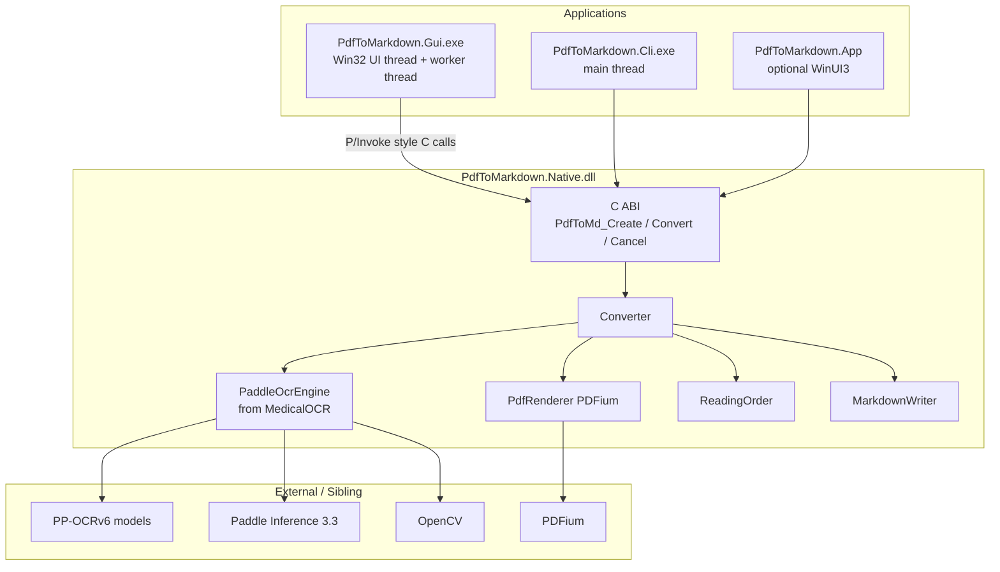
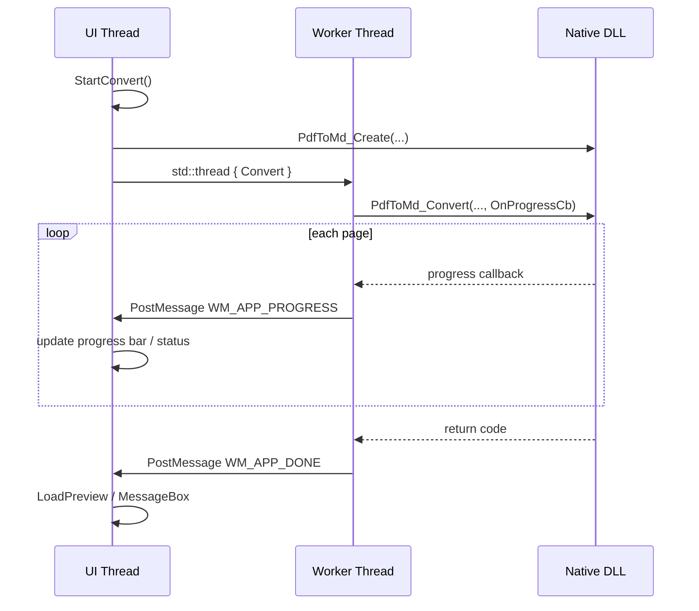

# 01 — 架构

## 三层结构



## 为什么要有 C ABI？

GUI / CLI / 未来 C# WinUI 都只调用稳定的 C 函数，**异常不跨 DLL**。

句柄类型：

```c
typedef struct PdfToMdHandleOpaque* PdfToMdHandle;
```

内部真正是：

```cpp
struct PdfToMdHandleOpaque {
    pdf_to_md::Converter converter;
    std::string last_error;
};
```

## 线程模型（GUI）



要点：

- **OCR 不在 UI 线程跑**，避免界面卡死
- 进度用 `PostMessage` 回 UI（线程安全）
- 取消：UI 调 `PdfToMd_Cancel` → Native 设 `cancel_requested_`，页循环检查后返回 `PDFMD_ERR_CANCELLED`

## CLI 线程模型

更简单：单线程 `main` 直接调 Create → Convert → Destroy；进度回调里 `printf`。

## 构建拓扑

```text
PdfToMarkdown (standalone CMake)
  ├── links MedicalOCR sources (paddle_ocr_engine, geometry_utils)
  ├── includes MedicalOCR cmake (Dependencies, PaddleOcrVendor)
  └── vendors PDFium under third_party/pdfium
```

关键 CMake 变量：

| 变量 | 含义 |
|------|------|
| `MEDICAL_OCR_ROOT` | 同级 MedicalOCR 路径，默认 `../MedicalOCR` |
| `PADDLE_INFERENCE_DIR` | `D:/Environment/paddle_inference_3.3.0` |
| `OpenCV_DIR` | `D:/Environment/opencv/build` |
| `PDF_TO_MD_STATIC_RUNTIME` | `/MT`，对齐 Paddle |
