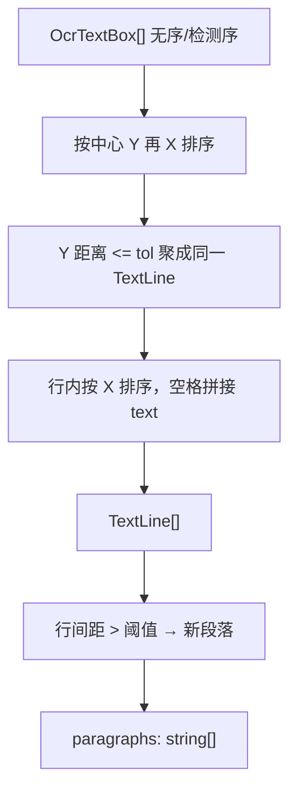

# 02 — 数据流（Data Stream）

## 端到端总览


## 各阶段数据结构

### 1) PDF 文件 → 内存文档

| 字段 | 说明 |
|------|------|
| `file_bytes_` | 整个 PDF 读入 `vector<uint8_t>`（支持中文路径） |
| `document_` | `FPDF_DOCUMENT`，生命周期内 `file_bytes_` 必须存活 |
| `page_count_` | 页数 |

加密 PDF → `IsEncrypted()` / 错误 `PDFMD_ERR_PDF_ENCRYPTED`。

### 2) 单页渲染 → 图像

```text
PDF page (points)
    × (dpi / 72)
        → bitmap BGRA (PDFium)
            → cv::cvtColor → cv::Mat BGR  (OpenCV)
```

- 默认 DPI **200**（配置可 150–300）
- **不写临时 PNG**；页图只在内存里
- 超大页边长会 clamp 到 8000，防 OOM

### 3) OCR → 文本框列表

`medical_ocr::OcrResult`（定义在 MedicalOCR `types.h`）：

```text
OcrResult
├── imageWidth / imageHeight
└── boxes[] : OcrTextBox
      ├── points[4]   # 四边形角点
      ├── text        # UTF-8 识别文字
      ├── confidence  # 0~1
      └── direction
```

内部 OCR 流水线（`RecognizeMat`）：

```text
BGR Mat
  → TextDetPredictor   # 检测框
  → SortQuadBoxes
  → CropByPolys        # 按多边形裁剪
  → TextRecPredictor   # 识别文字
  → 过滤 minimum_confidence
  → OcrResult.boxes
```

### 4) 阅读顺序 → 行 → 段落



关键类型：

```text
TextLine
├── y_center, height
├── boxes[]
└── text          # "Hello World"

PageMarkdown
├── page_index    # 0-based
└── paragraphs[]  # 每段可含软换行 \n
```

容差参数（相对字高）：

| 选项 | 默认 | 作用 |
|------|------|------|
| `line_y_tolerance_ratio` | 0.6 | 同行判定 |
| `paragraph_gap_ratio` | 1.8 | 段间距判定 |

### 5) Markdown 文档字符串

`BuildMarkdownDocument` 产出大致形态：

```markdown
<!-- generated-by: PdfToMarkdown 1.0.0 -->
<!-- source: scan.pdf -->

<!-- page: 1 -->

第一段文字  
同一段的下一行

---

<!-- page: 2 -->

第二页内容
```

规则：

- 正文对 `\` `` ` `` `*` `_` `[` `]` `|` 做转义
- 段内换行用 Markdown 软换行（行尾两空格 + `\n`）
- 页之间用 `---` 分隔
- 空页写占位：`_（本页无识别到文字）_`

### 6) 原子写盘

```text
content string
  → write utf-8 to  output.md.tmp
  → MoveFileEx / rename → output.md
```

失败则返回 `PDFMD_ERR_WRITE_FAILED`（权限、磁盘满等）。

## 进度回调里的“数据”

进度消息 **只有状态短句**，例如 `"OCR page 3"`，**从不包含 OCR 正文**。

回调签名：

```c
void (*)(void* user_data, int current_page, int total_pages, const char* message_utf8);
```

`Converter` 里大致节点：

| current | total | message |
|---------|-------|---------|
| 0 | 0 | Opening PDF |
| 0 | N | PDF opened |
| i | N | Rendering / OCR page … |
| i+1 | N | Finished page … |
| N | N | Writing Markdown / Done |

## 内存视角（单页峰值）

```text
PDF bytes（整文件常驻）
+ 当前页 BGR Mat（宽×高×3）
+ OCR 中间 crop / tensor（Paddle 内部）
+ 已完成页的 PageMarkdown 文本（相对小）
```

v1 **串行按页** OCR，避免多页并行把 CPU/内存打满。

## 填空横线 → `____`（几何检测）

试卷里的句中短填空、翻译题下长书写线是 **印刷横线**，OCR 往往认不出 `_`。管线在 OCR 之后增加：

```text
page BGR
  → BlankLineDetector（水平形态学 + 连通域）
  → 伪 OcrTextBox（text = "____..."）
  → 并入 ocr.boxes
  → BuildReadingLines（按坐标插入句中/另起一行）
```

配置（`ConvertOptions` / `pdf_to_md.json`）：

| 字段 | 默认 | 含义 |
|------|------|------|
| `enable_blank_line_detection` | true | 总开关 |
| `blank_min_width_px` | 0（自动） | 最短填空宽度 |
| `blank_max_thickness_px` | 0（自动） | 最大线粗 |
| `blank_long_width_ratio` | 0.45 | 相对页宽，偏长书写线 |

### 分栏（方案 A）

| 字段 | 默认 | 含义 |
|------|------|------|
| `enable_column_detection` | true | 按垂直空隙分左右栏 |
| `column_gap_min_ratio` | 0.10 | 空隙至少占页宽的比例 |
| `column_min_boxes_per_side` | 2 | 左右每侧最少文字框数 |

Markdown 导出时：**连续 `_` run（长度≥2）不转义**，单字符 `_` 仍转义，避免填空线变成 `\_\_\_\_`。

## 多栏阅读顺序（方案 A）

布局如「左文 | 中图 | 右文」时，若仍按 Y 同行拼接，会把左右栏拼成一行。方案 A：

```text
文字框 X 投影 → 找中间足够宽的垂直空隙（分界，不是用空格填空隙）
  → 左栏：BuildReadingLines + MergeParagraphs
  → 右栏：同上
  → Markdown 段落 = 左栏段落 + 右栏段落（先左后右）
```

- **上图下文**：下方文字横向连成一片，找不到左右空隙 → **保持单栏**，算法自动退回原逻辑。  
- 配置：`enable_column_detection`（默认 true）、`column_gap_min_ratio`、`column_min_boxes_per_side`。

