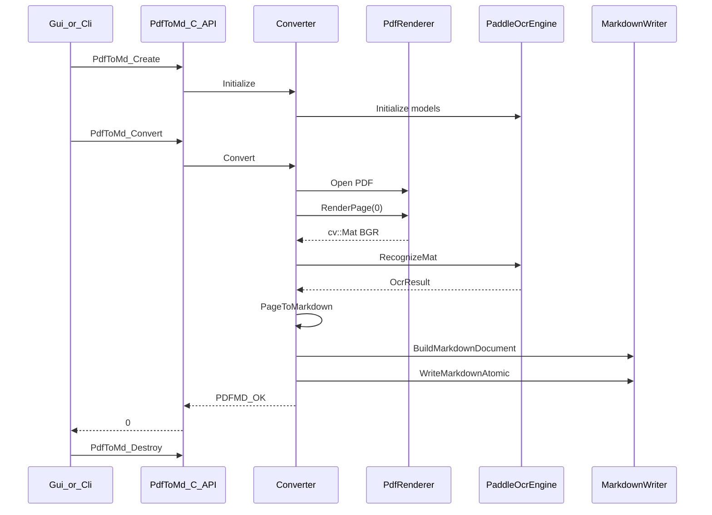

# 03 — 函数调用链（Call Chains）

## A. CLI 完整调用链

```text
main(argc, argv)                          # cli/main.cpp
  │  parse: input, -o, --models, --dpi, --threads
  │  build config JSON: {"dpi":..,"cpu_threads":..,"enable_mkldnn":false}
  │
  ├─ PdfToMd_Create(models, config, &handle)     # C API
  │     └─ new PdfToMdHandleOpaque
  │           └─ converter.Initialize(models, config)
  │                 ├─ parse JSON → ConvertOptions
  │                 ├─ make_unique<PaddleOcrEngine>()
  │                 └─ engine_->Initialize(models_dir, engine_cfg.dump())
  │                       ├─ resolve det/rec model dirs
  │                       ├─ TextDetPredictor(...)
  │                       └─ TextRecPredictor(...)
  │
  ├─ PdfToMd_Convert(handle, pdf, md, OnProgress, &st)
  │     └─ converter.Convert(pdf, md, cb)
  │           │  (详见下一节 Native Convert 链)
  │           └─ progress → OnProgress → printf "[cur/total] msg"
  │
  └─ PdfToMd_Destroy(handle)
        └─ converter.Shutdown() → engine_->Shutdown() → delete handle
```

退出码 = `PdfToMd_Convert` 返回的 `PdfToMdErrorCode`（0 成功）。

---

## B. GUI 完整调用链

### B1. 用户点「开始转换」

```text
WndProc WM_COMMAND / IDC_START
  └─ StartConvert()
        ├─ 读控件：pdf / md / models / dpi
        ├─ PdfToMd_Destroy(旧 handle)          # 若有
        ├─ PdfToMd_Create(models, config, &handle)
        ├─ SetUiRunning(true)                  # 禁用开始，启用取消
        └─ std::thread {
              PdfToMd_Convert(handle, pdf, md, OnProgressCb, nullptr)
                │
                │  每次 progress:
                │    OnProgressCb → new ProgressMsg → PostMessage(WM_APP_PROGRESS)
                │
              PostMessage(WM_APP_DONE, pair<rc, last_error>)
           }
```

### B2. UI 收到进度 / 完成

```text
WndProc WM_APP_PROGRESS
  └─ 更新 ProgressBar + Status 文本，delete ProgressMsg

WndProc WM_APP_DONE
  ├─ SetUiRunning(false)
  ├─ join worker
  ├─ rc==OK → LoadPreview(md_path) → MessageBox 完成
  ├─ rc==CANCELLED → 状态「已取消」
  └─ else → MessageBox 错误
```

### B3. 取消 / 关闭

```text
IDC_CANCEL / WM_DESTROY
  └─ PdfToMd_Cancel(handle)
        └─ converter.Cancel() → cancel_requested_ = true
              └─ Convert 页循环下一次检查 → return PDFMD_ERR_CANCELLED
```

### B4. 拖放 PDF

```text
WM_DROPFILES
  └─ 若扩展名 .pdf
        ├─ 填 PDF 编辑框
        └─ SuggestMdPath → 填 MD 路径（同名 .md）
```

---

## C. Native `Converter::Convert` 核心链（最重要）

```text
Converter::Convert(pdf_path, md_path, progress)
  │
  ├─ 校验 initialized_ / 路径 / busy_ CAS
  ├─ cancel_requested_ = false
  │
  ├─ progress(0,0,"Opening PDF")
  ├─ PdfRenderer renderer
  ├─ renderer.Open(pdf_path)
  │     ├─ ReadFileUtf8 → file_bytes_
  │     ├─ FPDF_InitLibraryWithConfig (refcount)
  │     └─ FPDF_LoadMemDocument → document_, page_count_
  │
  ├─ total = renderer.PageCount()
  │
  └─ for i in 0 .. total-1:
        │
        ├─ if cancel_requested_ → PDFMD_ERR_CANCELLED
        ├─ progress(i,total,"Rendering page i+1")
        ├─ renderer.RenderPage(i, dpi, page_bgr)
        │     ├─ FPDF_LoadPage
        │     ├─ FPDFBitmap_Create / FillRect / RenderPageBitmap
        │     ├─ BGRA buffer → cv::Mat → cvtColor BGR → clone
        │     └─ Destroy bitmap / ClosePage
        │
        ├─ if cancel_requested_ → CANCELLED
        ├─ progress(i,total,"OCR page i+1")
        ├─ engine_->RecognizeMat(page_bgr, ocr)
        │     ├─ detector_->Predict({image})
        │     ├─ SortQuadBoxes / CropByPolys
        │     ├─ recognizer_->Predict(crops)
        │     └─ fill OcrResult.boxes
        │
        ├─ pages.push_back( PageToMarkdown(i, ocr, options_) )
        │     ├─ BuildReadingLines(ocr, line_y_tolerance_ratio)
        │     │     ├─ geometry::BoxCenter / AxisAlignedBounds
        │     │     ├─ Y 聚类成 TextLine
        │     │     └─ 行内 X 排序 + JoinBoxes → line.text
        │     └─ MergeParagraphs(lines, paragraph_gap_ratio)
        │           └─ 按行距切段 → paragraphs[]
        │
        └─ progress(i+1,total,"Finished page i+1")

  ├─ progress(N,N,"Writing Markdown")
  ├─ md = BuildMarkdownDocument(pdf_path, pages)
  │     ├─ EscapeMarkdown / SanitizeHtmlComment
  │     └─ 拼 page markers + paragraphs + ---
  ├─ WriteMarkdownAtomic(md_path, md, err)
  │     ├─ write *.tmp
  │     └─ MoveFileEx → 目标 .md
  ├─ progress(N,N,"Done")
  └─ return PDFMD_OK
```

---

## D. C API ↔ C++ 映射表

| C API | 内部调用 |
|-------|----------|
| `PdfToMd_Create` | `Converter::Initialize` |
| `PdfToMd_Convert` | `Converter::Convert` + 包装 progress 回调 |
| `PdfToMd_Cancel` | `Converter::Cancel` |
| `PdfToMd_Destroy` | `Converter::Shutdown` + `delete handle` |
| `PdfToMd_GetLastError` | `handle->last_error` 或线程局部错误 |
| `PdfToMd_GetVersion` | 返回 `"1.0.0"` |

注意：`PdfToMd_Convert` 用 `try/catch` 包住，异常变成 `PDFMD_ERR_INTERNAL`，不抛出 DLL。

---

## E. 调用时序（单页 PDF）简化图



---

## F. 调试时建议下断点的位置

| 目的 | 文件 | 函数 |
|------|------|------|
| 看配置/模型是否加载 | `converter.cpp` | `Initialize` |
| 看 PDF 能否打开 | `pdf_renderer.cpp` | `Open` |
| 看页图像素尺寸 | `pdf_renderer.cpp` | `RenderPage` 末尾 |
| 看 OCR 框数量 | `paddle_ocr_engine.cpp` | `RecognizeMat` |
| 看行聚类效果 | `reading_order.cpp` | `BuildReadingLines` |
| 看最终 MD | `markdown_writer.cpp` | `BuildMarkdownDocument` |
| 看 GUI 线程切换 | `win32_gui/main.cpp` | `OnProgressCb` / `WM_APP_*` |
