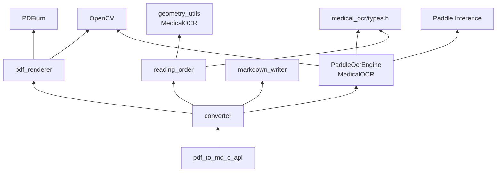

# 04 — 模块说明

## 模块依赖图



---

## 1. `pdf_to_md_c_api` — DLL 边界

**头文件：** `native/include/pdf_to_md/pdf_to_md_c_api.h`  
**实现：** `native/src/pdf_to_md_c_api.cpp`

职责：

- 导出稳定 C 函数
- 持有 `PdfToMdHandleOpaque`
- 把 C 进度回调转成 `std::function`
- 吞掉所有 C++ 异常

生命周期约定：

```text
Create → (Convert | Cancel)* → Destroy
```

同一 handle 上 **Convert 不能并发**（`busy_`）。

---

## 2. `Converter` — 编排中枢

**头文件：** `converter.h`  
**实现：** `converter.cpp`

成员：

| 成员 | 作用 |
|------|------|
| `options_` | DPI、线程、置信度、行/段阈值 |
| `engine_` | `unique_ptr<PaddleOcrEngine>` |
| `cancel_requested_` | 取消标志 |
| `busy_` | 防止重入 Convert |
| `last_error_` | 最近错误文案 |

它自己不渲染、不写文件细节，只 **按顺序调用** 其它模块。

---

## 3. `PdfRenderer` — PDF → 图像

**头文件：** `pdf_renderer.h`  
**实现：** `pdf_renderer.cpp`

| 方法 | 说明 |
|------|------|
| `Open` | UTF-8 路径读文件 → `FPDF_LoadMemDocument` |
| `RenderPage` | 指定页、DPI → `cv::Mat` BGR |
| `Close` | 关文档 + 库引用计数 |
| `PageCount` / `IsEncrypted` / `GetLastError` | 状态查询 |

PDFium 库用静态 `library_refcount_` + 全局 mutex，多实例安全初始化/销毁。

---

## 4. `reading_order` — 框 → 行 → 段

**头文件：** `reading_order.h`  
**实现：** `reading_order.cpp`

| 函数 | 输入 | 输出 |
|------|------|------|
| `BuildReadingLines` | `OcrResult` | `vector<TextLine>` |
| `BuildReadingLinesFromBoxes` | `vector<OcrTextBox>` | 同上（分栏后单栏用） |
| `FindColumnSplitX` | boxes + 页宽 + options | 是否分栏 + `split_x` |
| `MergeParagraphs` | `TextLine[]` | `vector<string>` |
| `PageToMarkdown` | page_index + OcrResult + options | `PageMarkdown`（方案 A：先左后右） |

依赖 MedicalOCR `geometry::BoxCenter` / `AxisAlignedBounds`。

v1：同行左→右、栏内上→下。**方案 A** 在检测到足够宽的垂直空隙时，先读完左栏再读右栏（空隙是分界，不用空格填）。上图下文等无左右空隙的页保持单栏。

---

## 5. `markdown_writer` — 字符串 → 文件

**头文件：** `markdown_writer.h`  
**实现：** `markdown_writer.cpp`

| 函数 | 作用 |
|------|------|
| `EscapeMarkdown` | 转义易破坏 MD 的字符 |
| `BuildMarkdownDocument` | 多页拼成完整 MD 文本 |
| `WriteMarkdownAtomic` | 临时文件 + 替换，UTF-8 无 BOM |

---

## 6. `PaddleOcrEngine`（来自 MedicalOCR）

路径：`MedicalOCR/src/ocr/paddle_ocr_engine.*`

对本项目最重要的入口是：

```cpp
bool RecognizeMat(const cv::Mat& image, OcrResult& result);
```

避免「页图 → PNG 编码 → 再解码」的浪费。

初始化需要模型目录结构：

```text
<models_dir>/
  PP-OCRv6_small_det/
  PP-OCRv6_small_rec/
```

强制：`enable_mkldnn=false`（与本机验收环境一致）。

---

## 7. GUI（`app/win32_gui/main.cpp`）

纯 Win32 + Common Controls：

- 控件：PDF/MD/模型路径、DPI、开始/取消、进度条、预览 Edit
- 拖放：`DragAcceptFiles`
- 后台：`std::thread` + `PostMessage`
- 预览：读输出 `.md` 前约 200KB 显示

不依赖 .NET，Build Tools 即可编译。

---

## 8. CLI（`cli/main.cpp`）

参数解析后只做三件事：Create → Convert → Destroy。  
适合脚本、回归、`scripts/run_integration.ps1`。

---

## 9. 测试关注点

| 测试文件 | 覆盖 |
|----------|------|
| `test_reading_order.cpp` | 同行左右、多行、分栏先左后右、上图下文单栏、关闭分栏 |
| `test_markdown_writer.cpp` | 转义、分页标记、原子写 |
| `test_error_codes.cpp` | 错误码常量 |

集成：`scripts/run_integration.ps1` 跑真实 PDF OCR，检查关键短语是否出现。
